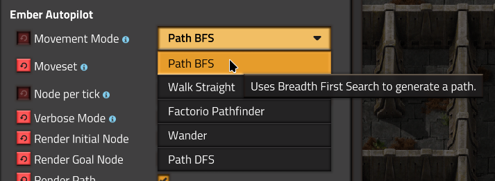
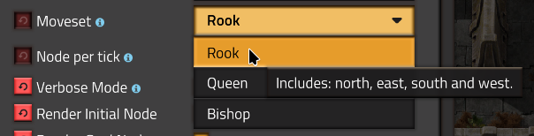
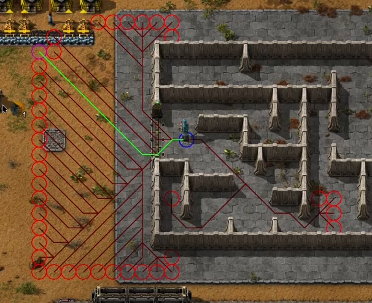
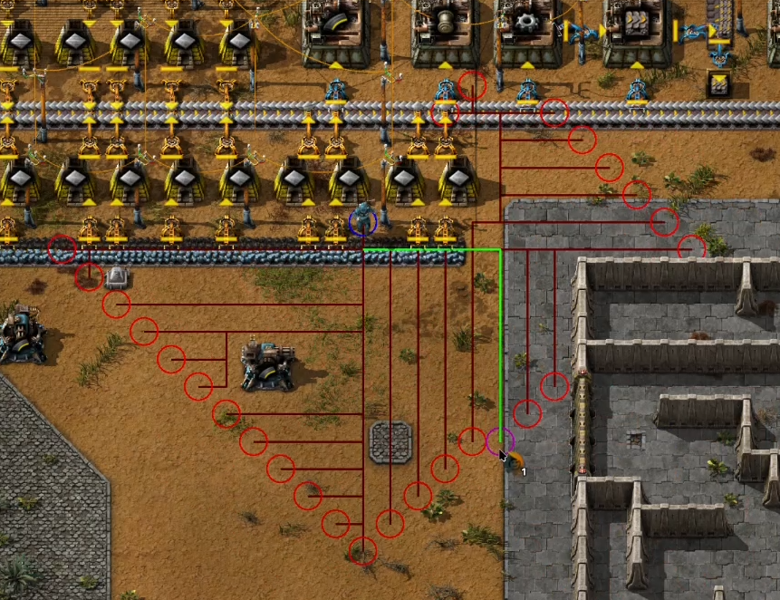
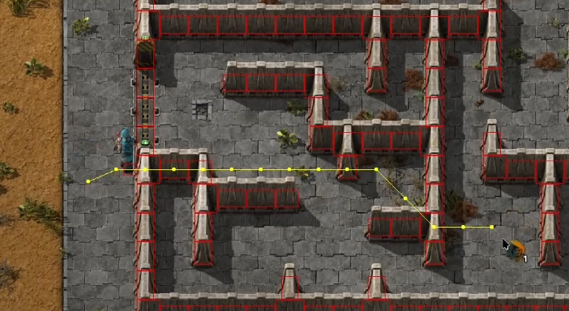
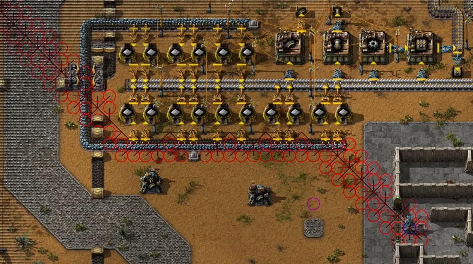

# Ember Autopilot


[](https://opensource.org/licenses/MIT)
[](https://github.com/Diordany/factorio-ember-autopilot/releases/tag/v0.6.0)

# Overview

This is my personal framework for AI experiments in Factorio. Everything is subject to change.

**Ember autopilot** works by binding agent programs to players to perform certain tasks. The autopilot is mainly controlled through a selection item named the **Ember Controller** and can alternatively be controlled through console commands.

One critical feature of **Ember AutoPilot** is it's ability to move autonomously, this is where the main focus of the development lies right now. At this point it has capabilities to do basic pathfinding, but it's still rough around the edges.

# Installation

You can install this mod through the built-in modloader of Factorio under the name "Ember Autopilot". Alternatively, you can manually install it using git or by downloading the source code in .zip format.

***Mod folder (Windows):*** `%appdata%\Factorio\mods`

***Mod folder (Mac OS X):*** `~/Library/Application\ Support/factorio/mods`

***Mod folder (Linux):*** `~/.factorio/mods`

## Installation with Git

```
cd <path to factorio mods>
git clone https://github.com/Diordany/factorio-ember-autopilot.git ember-autopilot_0.6.0
```

## Installation from ZIP

Just save the .zip file to the mod directory of Factorio as `ember-autopilot_0.6.0.zip` (or leave the name as is if downloading from the [releases page](https://github.com/Diordany/factorio-ember-autopilot/releases) or the [mod portal](https://mods.factorio.com/mod/ember-autopilot/downloads)).

# Ember Controller

To get access to the Ember Controller, you'll first need an empty inventory slot, then you can press the launcher button on the top left of your HUD:


Alternatively, you can run the following command:

```
/ember-controller
```

To get rid of the controller, just drop it on the ground (belts don't work).

# Movement

To move your agent, first equip the **Ember Controller**, then click on your target tile:


## Movement Mode

The movement mode can be set through the mod settings (per player):



| Option              | Description                                   |
|---------------------|-----------------------------------------------|
| Path BFS            | Uses Breadth First Search to generate a path. |
| Walk Straight       | Makes the agent walk in straight lines.       |
| Factorio Pathfinder | Uses the pathfinder provided by Factorio.     |
| Wander              | Makes the agent wander aimlessly.             |
| Path DFS            | Uses Depth First Search to generate a path.   |

If you want the agent to walk directly towards the goal position, you're best off using the `Walk Straight` option. For path generation, the `Path BFS` option is recommended over `Factorio Pathfinder` and `Path DFS` as the latter two are very unreliable.

## Moveset

The moveset setting determines what moveset is used for the search strategies of `Path BFS` and `Path DFS`. The names are based on the moveset of chess pieces.



| Option | Description |
|-|-|
| Rook | Includes: north, east, south and west. |
| Queen | Includes: north, northeast, east, southeast, south, southwest, west and northwest. |
| Bishop | Includes: northeast, southeast, southwest and northwest. |

In general, the `Rook` option is the most useful for the `Path BFS` and `Path DFS` modes, since they perform a blind search and don't take the movement cost into account.

## Cancel Movement

To cancel the agent's movement press `SHIFT + LMB` with the **Ember Controller** equiped.

Alternatively, you can cancel the agent with:

```
/ember-stop
```

## Path BFS

When the agent uses the BFS strategy, it tries to find the path with the least amount of actions [[1]](#1). This is not necessarily the optimal path [[1]](#1), since diagonal movement actions cover more distance and thus take longer. Search strategies that address this issue will be part of the next update.

Here's a screenshot of BFS pathfinding with the `Queen` moveset:



And another one with the `Rook` moveset:



***IMPORTANT:*** *keep in mind that the agent will keep on searching indefinitely if no valid path exists. In that case, stop the agent with `SHIFT + LMB`.*

## Factorio Path

The built-in pathfinder of Factorio doesn't seem to be particularly useful for this application. The paths are rarely optimal and route straight through collidable entities (even if the collision mask is given) as seen here:



## Path DFS

With the DSF strategy, the agent follows branches as far as it possible can, which is a big problem for vast or infinite search spaces [[1]](#1) (like the Factorio world):



Avoid this option unless you're in a closed environment. A bounded version is probably going to be introduced at some point.

# Performance Options

The amount of search nodes processed per tick can be set to tweak the search performance.

# References

<a id="1">[1]</a> 
&nbsp; S. Russel and P. Norvig, "Solving Problems by Searching", in *Artificial Intelligence A Modern Approach, 3rd ed.* Harlow: Pearson Education Limited, 2016, ch. 3, pp. 64-119.