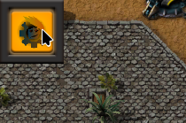
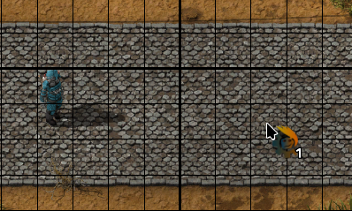
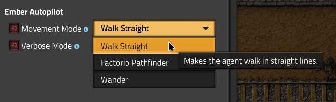

# Ember Autopilot


[](https://opensource.org/licenses/MIT)
[](https://github.com/Diordany/factorio-ember-autopilot/releases/tag/v0.5.0)

# Overview

This is my personal framework for AI experiments in Factorio. Everything is subject to change.

Ember autopilot works by binding agent programs to players to perform certain tasks. The autopilot is mainly controlled through a selection item named the **Ember Controller** and can alternatively be controlled through console commands.

One critical feature of Ember AutoPilot is it's ability to move autonomously, this is where the main focus of the development lies right now.

# Installation

You can install this mod through the built-in modloader of Factorio under the name "Ember Autopilot". Alternatively, you can manually install it using git or by downloading the source code in .zip format.

***Mod folder (Windows):*** `%appdata%\Factorio\mods`

***Mod folder (Mac OS X):*** `~/Library/Application\ Support/factorio/mods`

***Mod folder (Linux):*** `~/.factorio/mods`

## Installation with Git

```
cd <path to factorio mods>
git clone https://github.com/Diordany/factorio-ember-autopilot.git ember-autopilot_0.5.0
```

## Installation from ZIP

Just save the .zip file to the mod directory of Factorio as `ember-autopilot_0.5.0.zip` (or leave the name as is if downloading from the [releases page](https://github.com/Diordany/factorio-ember-autopilot/releases) or the [mod portal](https://mods.factorio.com/mod/ember-autopilot/downloads)).

# Ember Controller

To get access to the Ember Controller, you'll first need an empty inventory slot, then you can press the launcher button on the top left of your HUD:



Alternatively, you can run the following command:

```
/ember-controller
```

To get rid of the controller, just drop it on the ground (belts don't work).

# Movement

To move your agent, first equip the **Ember Controller**, then click on your target tile:



The movement procedure can be set through the mod settings (per player):



| Option              | Description                               |
|---------------------|-------------------------------------------|
| Walk Straight       | Makes the agent walk in straight lines.   |
| Factorio Pathfinder | Uses the pathfinder provided by Factorio. |
| Wander              | Makes the agent wander aimlessly.         |

The most reliable and recommended option at the moment is **Walk Straight**, the other two options are just there for demonstration purposes.

## Cancel Movement

To cancel the agent's movement press `SHIFT + LMB` with the **Ember Controller** equiped.

## Commands
The following commands can also be used instead:

| Command                  | Description                                                                          |
|--------------------------|--------------------------------------------------------------------------------------|
| `/ember-path <x> <y>`    | Uses the built-in pathing algorithm to find and follow a path to the given position. |
| `/ember-stop`            | Unbinds any agent that is assigned to the player.                                    |
| `/ember-walkpos <x> <y>` | Walks over to the given position.                                                    |
| `/ember-walkrel <x> <y>` | Covers the given displacement by walking.                                            |
| `/ember-wander`          | Wander around aimlessly.                                                             |